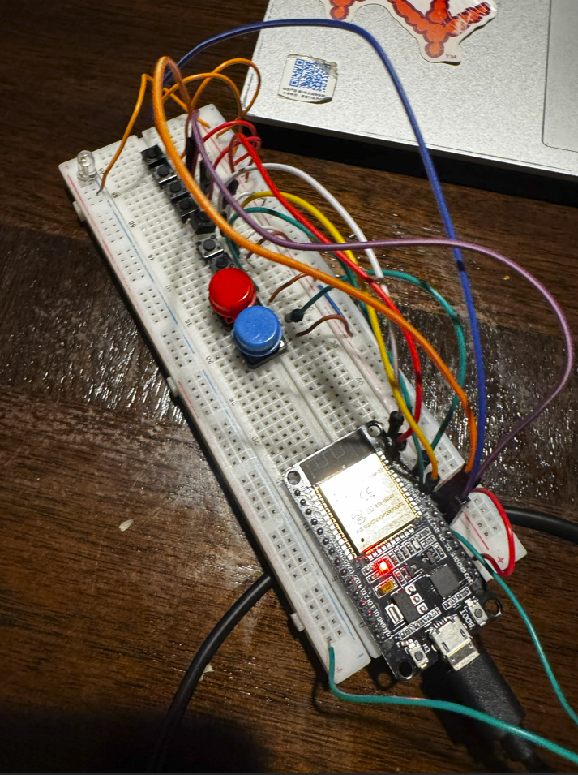

# LG-TV-Remote
My LG TV remote broke. Instead of buying a new one, I decided to build one myself and learn from the process!

I did some research online. Apparently LG TV remotes utalize an IR protocol knwon as NEC()

NEC Protocol Reference: https://www.sbprojects.net/knowledge/ir/nec.php

Helpful Video: https://www.youtube.com/watch?v=uPOJCv1hgB0&t=264s 

Because every TV manufactere uses a different address for every packet sent from the remote, the most reliable way to obtain that packet is to capture it using a Photo Transistor and decode it. 

Since I do not have a remote to decode, I had to dig to find the exact codes for the LG TV remote. Most of the sources I visited pointed to a commonly used standard set of NEC codes()

Which codes, I could now start programming. I decided to use an ESP 32 because it allows or scalbity of the project in the future. I also  used the youtuber EEVblog's video "IR Remote Control Arduino Protocol Tutorial" and his github code(linked in the description) as template to get started.

wirimg: 